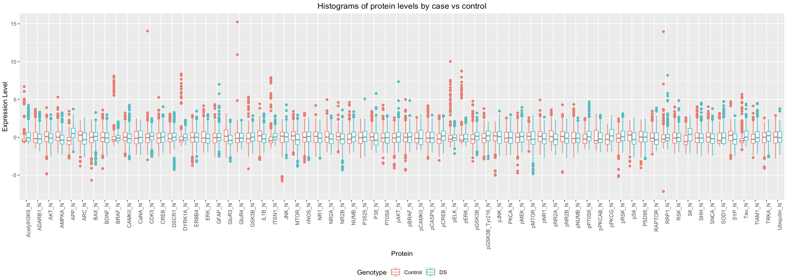
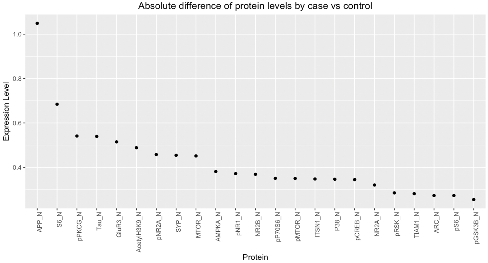
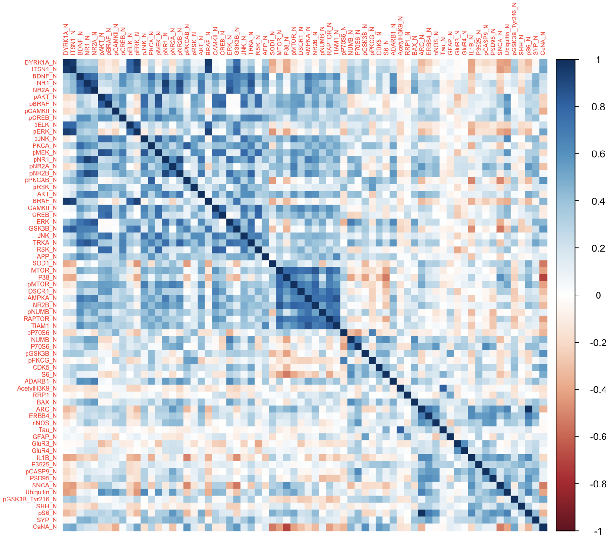
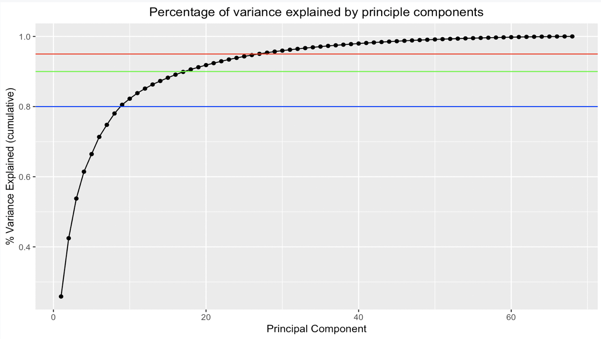

# Introduction

Down syndrome is a genetic disorder that originates from a full or partial extra copy of chromosome 21. The hallmarks of this syndrome include intellectual disability, developmental delays and distinct physical characteristics. Currently, there is no cure to Down syndrome, but screening and diagnostic tests exist for the condition. Some diagnostic tests such as amniocentisis have been demonstrated to increase the risk of miscarriage, so prenatal screening is preferred. A systematic review by Yao et. al demonstrated that two prenatal screening tests in serum have sensitivities ranging from 77% to 93%. However, amniocentisis is much more predictive of Down syndrome.

This disparity offers an interesting classification problem: given expression data, can we predict Down syndrome with comparable accuracy to screening and diagnostic tests? We'll use the *Mice Protein Expression* data set from Kaggle to explore this question. In its raw form, the data set contains expression levels for 77 proteins in 1080 mice. These mice were either controls or trisomic, so we can use this data set for classification purposes.

## Data Cleaning

```{r, warning = FALSE, message = FALSE }
set.seed(8106)
library(tidyverse)
library(visdat)
mice = read_csv('./data.csv') %>% 
  mutate(MouseID = 1:length(MouseID))
```

A quick check of the data reveals that it contains missing values. Below we'll visualize how the missing data is distributed.

```{r, fig.width = 5, fig.height = 3.3, fig.align = 'center'}
vis_miss(mice) + theme(axis.text = element_text(size = 3))
```

Two key observations come from this visualization of the missing data: 1) There is a small subset of mice missing almost half of their data, and 2) there is a small subset of proteins that are missing in most mice. To pare down the data set, we'll remove the mice that are missing most of their proteins and the proteins that are missing in most of the mice. 

```{r}
final.mice = mice %>% 
  filter(!(MouseID %in% c(988, 989, 990))) %>% 
  select_if(function(col) !any(is.na(col))) %>% 
  select(DYRK1A_N:Genotype) %>% 
  mutate(Genotype = ifelse(Genotype == "Control", 0, 1))

proteins = final.mice %>% 
  select(DYRK1A_N:CaNA_N) %>% 
  map_df(.x = ., function(col) (col - mean(col))/sd(col))

final.mice = cbind(proteins, Genotype = final.mice$Genotype)
```

The resulting data set contains 68 proteins with complete information on 1077 mice. Each of the candidate proteins were also centered and scaled. Trisomic status was relabeled numerically to `0|1`.

# Exploratory Data Analysis

A major challenge of this data set is its high dimensionality. It's highly likely that only a small subset of the proteins are significant in predicting Down syndrome status. Before we attempt to make predictions on our data, we'll explore and visualize it to inform any modeling we may want to do.

## Looking for candidate proteins

The immediate first thing to check is if there are any proteins that help distinguish between cases and controls. Figure 1 lays out these differences.

```{r, eval = FALSE, echo = FALSE }
hist.data = final.mice %>% 
  gather(., key = "protein", value = "level", DYRK1A_N:CaNA_N) %>% 
  mutate(Genotype = ifelse(Genotype == 0, "Control", "DS"))
  
ggplot(data = hist.data, aes(x  = protein, y = level, color = Genotype)) +
  geom_boxplot() + 
  theme(axis.text.x = element_text(angle = 90, hjust = 1),
        legend.position = "bottom",
        plot.title = element_text(hjust = 0.5)) +
  labs(
    title = "Histograms of protein levels by case vs control",
    x = "Protein",
    y = "Expression Level"
  )
```



The major takeaway from Figure 1 is that any differences that exist between the expression levels for each protein are small. There are notably more outliers for control mice for some proteins. No single protein seems to definitively classify cases against controls, so it might be helpful to at least see where the biggest differences are. 

```{r, eval = FALSE }
hist.data2 = final.mice %>% 
  gather(., key = "protein", value = "level", DYRK1A_N:CaNA_N) %>% 
  mutate(Genotype = ifelse(Genotype == 0, "Control", "DS")) %>% 
  group_by(protein, Genotype) %>% 
  summarise(mean = mean(level)) %>% 
  spread(., key = Genotype, value = mean) %>% 
  mutate(mean_diff  = abs(DS - Control)) %>% 
  arrange(-mean_diff)
  
ggplot(data = subset(hist.data2, mean_diff > 0.25), 
       aes(x  = reorder(protein, -mean_diff), y = mean_diff)) +
  geom_point() + 
  theme(axis.text.x = element_text(angle = 90, hjust = 1),
        legend.position = "bottom",
        plot.title = element_text(hjust = 0.5)) +
  labs(
    title = "Absolute difference of protein levels by case vs control",
    x = "Protein",
    y = "Expression Level"
  )
```



Out of the 68 remaining proteins, only 23 have more than a difference of 0.25 between the group means for expression levels. Only 9 have a difference greater than 0.4. This finding supports our suspicion that only a small subset of the proteins offer good discriminatory power.

## Examining inter-protein correlation

Biologically, protein expression is done in cascades. Thus, we would expect groups of proteins to be highly correlated with each other, representing the interplay of up and down-regulation. If this is the case, we would be able to further pare down our candidate variables for use in modeling. Figure 3 contains the correlation plot for all the proteins in the data set. 

```{r, eval = FALSE }
library(corrplot)
proteins = final.mice %>% select(-Genotype)
corrplot(cor(proteins), method = "color", tl.cex = 0.5)
```



Figure 3 confirms that there is a high degree of positive correlation within the data set. These proteins are likely to be within the same pathway, and thus having them in the same model won't help with classification. For our models, we need to use a form of dimension reduction.

## Principal Component Analysis

Following the findings from the correlation plot, we decided to see if principal component analysis would allow us to reduce the dimensionality of our data set for supervised learning. 

```{r, eval = FALSE }
# Perform the PCA
pca = prcomp(proteins)

# Plot out the variance explained by each PC
tib = tibble(
  PC = 1:ncol(pca$rotation),
  var = pca$sdev^2 / sum(pca$sdev^2),
  cumvar = cumsum(var)
)

ggplot(data = tib, aes(x = PC, y = cumvar)) + 
  geom_line() + 
  geom_point() +
  geom_hline(yintercept = 0.8, color = "blue") + 
  geom_hline(yintercept = 0.9, color = "green") + 
  geom_hline(yintercept = 0.95, color = "red") + 
  labs(
    title = "Percentage of variance explained by principle components",
    x = "Principal Component",
    y = "% Variance Explained (cumulative)"
  ) +
  theme(plot.title = element_text(hjust = 0.5))
```



Figure 4 illustrates that a high degree of variance can be explained by just a few principal components. The blue, green and red lines represent the threshold for 80%, 90% and 95% of the variance, respectively. 9 components explain at least 80% of the variance, 18 components explain 90% of the variance, and 27 components explain 95%. For our problem, we want to emphasize greater predictive ability, we'll opt to use the first 27 principal components. 

```{r}
reduced.pca.mice = as_tibble(pca$x[,1:27])
```


# References

1. Yao Y, Liao Y, Han M, Li SL, Luo J, Zhang B. Two kinds of common prenatal screening tests for Down's syndrome: a systematic review and meta-analysis. Sci Rep. 2016;6:18866. Published 2016 Jan 6. doi:10.1038/srep18866
