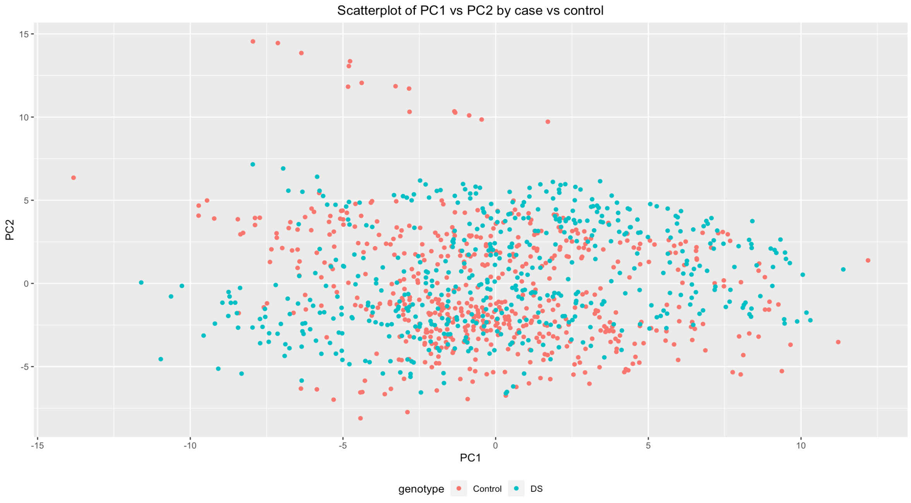
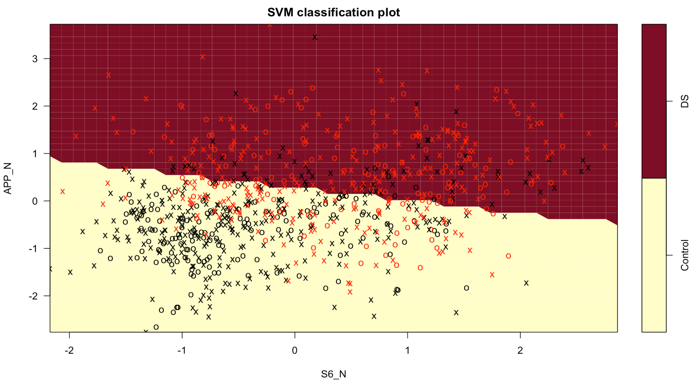

# Introduction

Down Syndrome is a genetic disorder that originates from a full or partial extra copy of chromosome 21. The hallmarks of this syndrome include intellectual disability, developmental delays and distinct physical characteristics. Currently, there is no cure to Down Syndrome, but screening and diagnostic tests exist for the condition. Some diagnostic tests such as amniocentisis have been demonstrated to increase the risk of miscarriage, so prenatal screening is preferred. A systematic review by Yao et. al demonstrated that two prenatal screening tests in serum have sensitivities ranging from 77% to 93%. However, amniocentisis is much more predictive of Down Syndrome.

This disparity offers an interesting classification problem: given expression data, can we predict Down Syndrome with comparable accuracy to screening and diagnostic tests? We'll use the *Mice Protein Expression* dataset from Kaggle to explore this question. In its raw form, the dataset contains expression levels for 77 proteins in 1080 mice. These mice were either controls or trisomic, so we can use this dataset for classification purposes.

## Data Cleaning

```{r, warning = FALSE, message = FALSE, echo = FALSE }
set.seed(8106)
library(tidyverse)
library(visdat)
mice = read_csv('./data.csv') %>% 
  mutate(MouseID = 1:length(MouseID))
```

A quick check of the data reveals that it contains missing values. Below we'll visualize how the missing data is distributed.

```{r, fig.width = 5, fig.height = 3.3, fig.align = 'center', echo = FALSE}
vis_miss(mice) + theme(axis.text = element_text(size = 3))
```

Two key observations come from this visualization of the missing data: 1) There is a small subset of mice missing almost half of their data, and 2) there is a small subset of proteins that are missing in most mice. To pare down the dataset, we'll remove the mice that are missing most of their proteins and the proteins that are missing in most of the mice. 

```{r, echo = FALSE}
final.mice = mice %>% 
  filter(!(MouseID %in% c(988, 989, 990))) %>% 
  select_if(function(col) !any(is.na(col))) %>% 
  select(DYRK1A_N:Genotype) %>% 
  mutate(Genotype = ifelse(Genotype == "Control", 0, 1))

proteins = final.mice %>% 
  select(DYRK1A_N:CaNA_N) %>% 
  map_df(.x = ., function(col) (col - mean(col))/sd(col))

final.mice = cbind(proteins, Genotype = final.mice$Genotype)
```

The resulting dataset contains 68 proteins with complete information on 1077 mice. Each of the candidate proteins were also centered and scaled. Trisomic status was relabeled numerically to `0|1`.

# Exploratory Data Analysis

A major challenge of this dataset is its high dimensionality. It's highly likely that only a small subset of the proteins are significant in predicting Down Syndrome status. Before we attempt to make predictions on our data, we'll explore and visualize it to inform any modeling we may want to do.

## Looking for candidate proteins

The immediate first thing to check is if there are any proteins that help distinguish between cases and controls. Figure 1 lays out these differences.

```{r, eval = FALSE, echo = FALSE }
hist.data = final.mice %>% 
  gather(., key = "protein", value = "level", DYRK1A_N:CaNA_N) %>% 
  mutate(Genotype = ifelse(Genotype == 0, "Control", "DS"))
  
ggplot(data = hist.data, aes(x  = protein, y = level, color = Genotype)) +
  geom_boxplot() + 
  theme(axis.text.x = element_text(angle = 90, hjust = 1),
        legend.position = "bottom",
        plot.title = element_text(hjust = 0.5)) +
  labs(
    title = "Histograms of protein levels by case vs control",
    x = "Protein",
    y = "Expression Level"
  )
```


The major takeaway from Figure 1 is that any differences that exist between the expression levels for each protein are small. There are notably more outliers for control mice for some proteins. No single protein seems to definitively classify cases against controls, so it might be helpful to at least see where the biggest differences are. 

```{r, eval = FALSE, echo = FALSE }
hist.data2 = final.mice %>% 
  gather(., key = "protein", value = "level", DYRK1A_N:CaNA_N) %>% 
  mutate(Genotype = ifelse(Genotype == 0, "Control", "DS")) %>% 
  group_by(protein, Genotype) %>% 
  summarise(mean = mean(level)) %>% 
  spread(., key = Genotype, value = mean) %>% 
  mutate(mean_diff  = abs(DS - Control)) %>% 
  arrange(-mean_diff)
  
ggplot(data = subset(hist.data2, mean_diff > 0.25), 
       aes(x  = reorder(protein, -mean_diff), y = mean_diff)) +
  geom_point() + 
  theme(axis.text.x = element_text(angle = 90, hjust = 1),
        legend.position = "bottom",
        plot.title = element_text(hjust = 0.5)) +
  labs(
    title = "Absolute difference of protein levels by case vs control",
    x = "Protein",
    y = "Expression Level"
  )
```


Out of the 68 remaining proteins, only 23 have more than a difference of 0.25 between the group means for expression levels. Only 9 have a difference greater than 0.4. This finding supports our suspicion that only a small subset of the proteins offer good discriminatory power.

## Examining inter-protein correlation

Biologically, protein expression is done in cascades. Thus, we would expect groups of proteins to be highly correlated with each other, representing the interplay of up and down-regulation. If this is the case, we would be able to further pare down our candidate variables for use in modeling. Figure 3 contains the correlation plot for all the proteins in the dataset. 

```{r, eval = FALSE, echo = FALSE }
library(corrplot)
proteins = final.mice %>% select(-Genotype)
corrplot(cor(proteins), method = "color", tl.cex = 0.5)
```


Figure 3 confirms that there is a high degree of positive correlation within the dataset. These proteins are likely to be within the same pathway, and thus having them in the same model won't help with classification. For our models, we need to use a form of dimension reduction.

## Principal Component Analysis

Following the findings from the correlation plot, we decided to see if principal component analysis would allow us to reduce the dimensionality of our dataset for supervised learning. 

```{r, eval = FALSE, echo = FALSE }
# Perform the PCA
pca = prcomp(proteins)

# Plot out the variance explained by each PC
tib = tibble(
  PC = 1:ncol(pca$rotation),
  var = pca$sdev^2 / sum(pca$sdev^2),
  cumvar = cumsum(var)
)

ggplot(data = tib, aes(x = PC, y = cumvar)) + 
  geom_line() + 
  geom_point() +
  geom_hline(yintercept = 0.8, color = "blue") + 
  geom_hline(yintercept = 0.9, color = "green") + 
  geom_hline(yintercept = 0.95, color = "red") + 
  labs(
    title = "Percentage of variance explained by principle components",
    x = "Principal Component",
    y = "% Variance Explained (cumulative)"
  ) +
  theme(plot.title = element_text(hjust = 0.5))
```


Figure 4 illustrates that a high degree of variance can be explained by just a few principal components. The blue, green and red lines represent the threshold for 80%, 90% and 95% of the variance, respectively. 9 components explain at least 80% of the variance, 18 components explain 90% of the variance, and 27 components explain 95%. For our report, we want to emphasize greater predictive ability, so we'll use the first 27 principal components. We hoped to see that the PCA would cause greater separation between the cases and controls, but we did not see this in plotting the principal components against each other, as seen in Figure 5:

```{r, eval = FALSE, echo = FALSE}
pca.combined = as_tibble(cbind(pca$x, factor(final.mice$genotype))) %>% 
  mutate(genotype = factor(ifelse(V69 == 1, "Control", "DS")))
ggplot(data = pca.combined, aes(x = PC1, y = PC2, color = genotype)) +
  geom_point() +
  theme(legend.position = "bottom", plot.title = element_text(hjust = 0.5)) +
  labs(
    title = "Scatterplot of PC1 vs PC2 by case vs control",
    x = "PC1",
    y = "PC2"
  )
```


Despite this, we still felt that there was value in using the reduced dataset in prediction. As such, we'll also compare the predictive ability of our models using both the full dataset and the reduced PCA version. Our final model will be chosen based off of how it performs in cross-validation.

# Models

The nature of our dataset and the results of our exploratory data analysis led us to pick a set of 5 models to attempt to predict Down Syndrome: a logistic-LASSO, K-Nearest neighbors (KNN), boosting, bagging and a support vector machine (SVM). With the high dimensionality of the dataset, we thought that the logistic-LASSO would provide some useful variable selection to narrow down the full set of proteins to just those that had true associations, though it assumes a linear relationship between the proteins and the probability of having Down Syndrome. 

We saw that many of the differences in mean protein expression level were extremely slight between cases and controls, so this led us to boosting and bagging; we thought that perhaps the aggregation of trees that incorporate all the truly necessary proteins into the decision would produce better results and take advantage of all these small differences. Though we sacrifice model interpretability, we hoped to gain in predictive power.

Biological intuition led us to choose KNN and SVM with a radial kernel; since we found that many of the proteins were correlated with each other, we thought that the cases and controls might be clustered to each other on a higher dimesion than we could see with just simple visualization. KNN and SVM would take advantage of this. Like bagging and boosting, we knew we would exchange interpretability for prediction. KNN suffers in high dimensional problems, whereas SVM does not. 

With each of these models, we used `caret` to select a set of tuning parameters that produced the best cross-validation classification error. We also used this metric to pick our final model. In deciding a proper range for tuning parameters, we experimented and investigated which range of values properly captured a maximum value before doing the comparisons. 

Table 1 below lays out the cross-validation and test error for each of the models and for both the full and PCA-reduced dataset. 

```{r, eval = FALSE, echo = FALSE }
tib = tibble(
  `Model` = c("Logistic-LASSO", "KNN", "Boosting", "Bagging", "SVM"),
  `Full Data: CV Error` = c(LOGLASSO.CV.ERR, 
                            KNN.CV.ERR, 
                            BOOST.CV.ERR, 
                            BAG.CV.ERR, 
                            SVM.CV.ERR),
  `PCA Data: CV Error` = c(LOGLASSO.PCA.CV.ERR,
                           KNN.PCA.CV.ERR, 
                           BOOST.PCA.CV.ERR, 
                           BAG.PCA.CV.ERR, 
                           SVM.PCA.CV.ERR),
  `Full Data: Test Error` = c(LOGLASSO.TEST.ERR, 
                              KNN.TEST.ERR, 
                              BOOST.TEST.ERR, 
                              BAG.TEST.ERR, 
                              SVM.TEST.ERR),
  `PCA Data: Test Error` = c(LOGLASSO.PCA.TEST.ERR,
                             KNN.PCA.TEST.ERR, 
                             BOOST.PCA.TEST.ERR, 
                             BAG.PCA.TEST.ERR, 
                             SVM.PCA.TEST.ERR)
)
# write_csv(tib, "error-table.csv")
```

```{r, echo = FALSE, message = FALSE, warning = FALSE }
library(tidyverse)
library(kableExtra)
errs = read_csv("./error-table.csv")
knitr::kable(errs, booktabs = TRUE, digits = 5, align = "c",
             caption = "Table 1: CV and test error") %>% kable_styling()
```

The table demonstrates that the CV error approximates the test error well. A curiousity that arose during analysis was that the KNN model had perfect test performance. The model that performed the best in cross-validation was the SVM model, so we choose it as our final model instead of KNN. Our final choice was influenced by the fact that our dataset was high dimensional, so the SVM was ultimately better suited to this problem. It performed the best in the full dataset, and even second-best for the reduced dataset. The best tune for our radial-kernel was `cost = 1` and $\sigma = 0.04798$.

One of the main limitations of the support vector machine is its diminished interpretability, and this is compounded by the high dimensionality of our dataset. The black-box nature of the SVM makes it difficult to ascertain which variables play a role in predicting Down Syndrome status. In our exploratory data analysis, we found the proteins that had the greatest mean difference between cases and controls. We used this to our advantage and visualized how well the SVM classified the observations along the top 2 proteins with the largest differences.



We can see in Figure 6 that the cases (red) have a reasonable amount of separation from the controls (black), and that the SVM boundary captures this weak separation well. This plot represents the best case scenario, but it at least helps convince us that the SVM is doing a satisfactory job of separation in a difficult context.

# Conclusions

We conclude that the radial SVM is an excellent model for this problem, but note that while it maximizes predictive value, it poses a potential problem for researchers looking to understand the relationships between the proteins and the condition. We expected SVM to excel in our high dimensional problem, and it proved to be useful with both the full and the PCA-reduced datasets. We thought that having PCA dataset might help in better dividing the cases and controls, but we did not see this in the cross-validation and test errors. Despite the lack of interpretability from the SVM, the success of the model indicates that even small differences in many, many proteins can help discern between a control and a case. With a condition as life-altering as Down Syndrome, we may want to accept the lack of interpretability if it helps us detect it with greater precision than current diagnostic tools allow.

# References

1. Yao Y, Liao Y, Han M, Li SL, Luo J, Zhang B. Two kinds of common prenatal screening tests for Down's Syndrome: a systematic review and meta-analysis. Sci Rep. 2016;6:18866. Published 2016 Jan 6. doi:10.1038/srep18866
